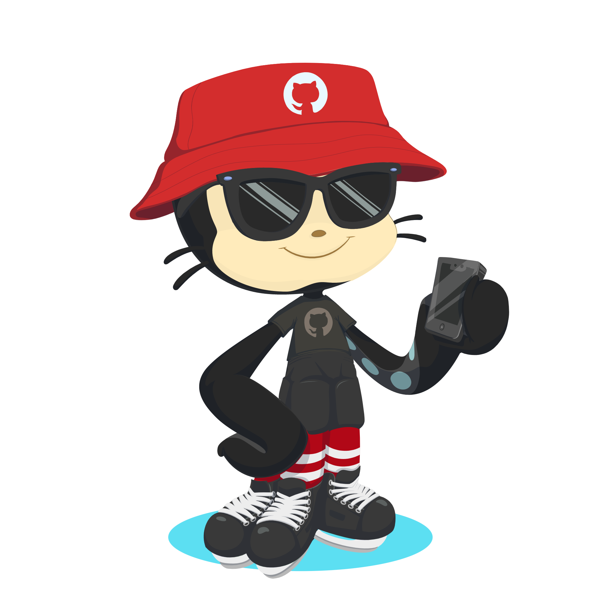

<h1 align="center">🌟 Práctica 5 - Visión por Computador (Curso 2024/2025)</h1>

</a>
Se han completado todas las tareas solicitadas de la **Práctica 5** para la asignatura **Visión por Computador**. Detección y caracterización de caras.

*Trabajo realizado por*:

[](https://github.com/kratoscordoba7)

[](https://github.com/AlejandroDavidArzolaSaavedra)

## 🛠️ Librerías Utilizadas

[](https://opencv.org/)
[](https://mediapipe.dev/)
[](https://numpy.org/)
[](https://www.mathworks.com/)
[](https://docs.python.org/3/library/random.html)
[](https://docs.python.org/3/library/time.html)
[](https://mediapipe.dev/)


---
## 🚀 Cómo empezar

Para comenzar con el proyecto, sigue estos pasos:

> [!NOTE]  
> Debes de situarte en un environment configurado como se definió en el cuaderno de la práctica 1  de [otsedom](https://github.com/otsedom/otsedom.github.io/blob/main/VC/P1/README.md#111-comandos-basicos-de-anaconda). Además, es necesario instalar la biblioteca de MediaPipe.

### Paso 1: Abrir VSCode y situarse en el directorio:
   
   `C:\Users\TuNombreDeUsuario\anaconda3\envs\VCP5
   
### Paso 2: Clonar y trabajar en el proyecto localmente (VS Code)
1. **Clona el repositorio**: Ejecuta el siguiente comando en tu terminal para clonar el repositorio:
   ```bash
   git clone https://github.com/kratoscordoba7/VCP5.git
   ```
2. Una vez clonado, todos los archivos han de estar situado en el environment del paso 1

### Paso 3: Abrir Anaconda prompt y activar el envioroment:
   ```bash
   conda activate NombreDeTuEnvironment
   ```
Tras estos pasos debería poder ejecutar el proyecto localmente

---

<h2 align="center">📋 Tareas</h2>

### Tarea 1: Detectores Faciales y Filtros

Hemos diseñado filtros que se activan cuando el usuario abre la boca. Usando el teclado:

- **Modo 1 - "Hamburguesa"**: Cuando abres la boca, aparecen hamburguesas alrededor de ti.

- **Modo 2 - "Duende"**: Al abrir la boca, comienza a llover dinero sobre ti.

- **Modo 3 - "Dios"**: Tu cabello se vuelve blanco y aparece un halo sobre tu cabeza.


> [!IMPORTANT]  
> Optamos por usar MediaPipe debido a que es una biblioteca que ofrece una amplia variedad de funcionalidades y alta calidad en sus resultados. Demostró ser la mejor opción para nuestras necesidades. Uno de los factores clave por los que optamos por MediaPipe es la malla de puntos faciales que proporciona, lo que facilita enormemente la interacción y el seguimiento preciso del rostro.


### Modo lluvia de hamburguesas

En este modo se tiene continúamente una gorra de un restaurante en la cabeza y cuando se abre la boca se visualiza una lluvia de hamburguesas, cuando las hamburguesas llegan a la parte inferior de la pantalla se resetea su posición a la parte superior. En esta sección del documento se explicará cómo funciona este filtro y también su visualización:

```python
def apply_hat(frame, face_landmarks):
    # Utilizamos los puntos 183 y 332 de la malla facial como referencia para la parte superior de la cabeza
    head_top = (int(face_landmarks.landmark[183].x * frame.shape[1]), 
                int(face_landmarks.landmark[332].y * frame.shape[0]))

    # Calculamos la posición promedio en Y de los puntos para ajustar mejor el lugar donde se colocará la gorra
    head_top_avg_y = int((face_landmarks.landmark[183].y + face_landmarks.landmark[332].y) * frame.shape[0] / 2)

    # Obtener los ángulos de rotación de la cabeza
    angle_horiz, angle_vert = get_head_rotation(face_landmarks)
    
    # Aplicar una transformación de rotación a la gorra
    rotation_matrix = cv2.getRotationMatrix2D((hat_img.shape[1] // 2, hat_img.shape[0] // 2), 
                                              math.degrees(angle_horiz), 1)  # Rotación en el eje horizontal
    
    # Ajustar la posición de la gorra
    x_offset = head_top[0] - hat_img.shape[1] // 2  # Centrado horizontalmente
    y_offset = head_top_avg_y - (hat_img.shape[0] // 2)  # Ajuste hacia la parte superior de la cabeza
    y_offset -= 150  # Desplazamiento hacia arriba para ajustar la gorra sobre la cabeza

    # Asegurarnos de que la gorra no se salga de la imagen
    frame_height, frame_width = frame.shape[:2]
    if x_offset < 0: x_offset = 0
    if y_offset < 0: y_offset = 0

    if x_offset + hat_img.shape[1] > frame_width: x_offset = frame_width - hat_img.shape[1]
    if y_offset + hat_img.shape[0] > frame_height: y_offset = frame_height - hat_img.shape[0]

    # Verificar que la gorra está dentro de los límites del frame
    if x_offset + hat_img.shape[1] <= frame_width and y_offset + hat_img.shape[0] <= frame_height:
        # Obtener la región de interés (ROI) en el frame
        roi = frame[y_offset:y_offset + hat_img.shape[0], x_offset:x_offset + hat_img.shape[1]]
        
        # Rotar la gorra con la matriz de rotación
        rotated_hat = cv2.warpAffine(hat_img, rotation_matrix, (hat_img.shape[1], hat_img.shape[0]))

        # Asegurarnos de que la gorra tiene un canal alfa para manejar la transparencia
        for c in range(0, 3):
            roi[:, :, c] = roi[:, :, c] * (1.0 - rotated_hat[:, :, 3] / 255.0) + \
                            rotated_hat[:, :, c] * (rotated_hat[:, :, 3] / 255.0)

        # Colocar la gorra rotada en el frame
        frame[y_offset:y_offset + rotated_hat.shape[0], x_offset:x_offset + rotated_hat.shape[1]] = roi
```

Esta función superpone una imagen de una gorra sobre la cabeza de una persona en un frame. Utiliza los puntos de referencia faciales para posicionar y rotar la gorra para que se alinee con la orientación de la cabeza detectada.

Pasos detallados:

- Detección de la posición de la cabeza:
   - Se utilizan los puntos 183 y 332 de la malla facial proporcionada por face_landmarks para calcular la posición superior de la cabeza.
   - Se calcula la posición promedio en el eje Y de estos puntos para ajustar el lugar donde se colocará la gorra.
- Cálculo de la rotación de la cabeza:
   - Se obtiene el ángulo de rotación horizontal y vertical de la cabeza mediante la función get_head_rotation(face_landmarks).
   - Estos ángulos permiten rotar la gorra de acuerdo con la orientación actual de la cabeza.
- Ajuste de la posición de la gorra:
   - Se calcula el desplazamiento en los ejes X e Y para centrar la gorra sobre la cabeza.
   - Se aplica un ajuste adicional en el eje Y (y_offset -= 150) para posicionar la gorra justo encima de la cabeza.
- Verificación de límites del fotograma:
   - Se asegura que la gorra no se salga de los límites del fotograma ajustando los desplazamientos si es necesario.
- Superposición de la gorra en el fotograma:
   - Se extrae la región de interés (ROI) del fotograma donde se colocará la gorra.
   - Se combina la gorra rotada con el ROI utilizando el canal alfa de la gorra para manejar la transparencia.
- Finalmente, se actualiza el fotograma con el ROI modificado que incluye la gorra.

```python
def draw_burgers(distance, lip_top, frame):
    frame_height, frame_width = frame.shape[0], frame.shape[1]
    
    if distance > 60:  # Umbral
        burger_resized = cv2.resize(burger_img, (50, 50))
        burger_width, burger_height = burger_resized.shape[1], burger_resized.shape[0]

        # Generar nuevas hamburguesas en la parte derecha e izquierda de la cara
        for i in range(5):  # Número de hamburguesas a mostrar
            if i >= len(burger_positions):
                center_x, center_y = frame_width // 2, frame_height // 2  # Coordenadas centrales del frame
                # Inicializar la posición de las hamburguesas al estilo json
                burger_positions.append({
                    "x": center_x + (i - 2) * (burger_width + 20),
                    "y": center_y - burger_height // 2,
                    "direction": 1,                    # Dirección hacia abajo
                    "side": "right"                    # Indicar que es del lado derecho
                })
                burger_positions.append({
                    "x": lip_top[0] - 100 - (i * 80),  # Espaciado entre hamburguesas en el lado izquierdo
                    "y": -burger_height,               # Comenzar desde la parte superior fuera de la vista
                    "direction": 1,                    # Dirección hacia abajo
                    "side": "left"                     # Indicar que es del lado izquierdo
                })
            
            # Actualizamos la posición de las hamburguesas
            for j in range(len(burger_positions)):
                burger_positions[j]["y"] += burger_positions[j]["direction"] * 5  # Mover hacia abajo
                if burger_positions[j]["y"] > frame_height: burger_positions[j]["y"] = burger_height  # Volver a la parte superior

                # Verificar que la hamburguesa no se salga del cuadro
                x_offset, y_offset  = burger_positions[j]["x"], burger_positions[j]["y"]

                if x_offset + burger_width <= frame_width and y_offset + burger_height <= frame_height:
                    # Dibujar la hamburguesa en su nueva posición
                    for c in range(0, 3):
                        try:
                            frame[y_offset:y_offset+burger_height, x_offset:x_offset+burger_width, c] = \
                                burger_resized[:, :, c] * (burger_resized[:, :, 3] / 255.0) + \
                                frame[y_offset:y_offset+burger_height, x_offset:x_offset+burger_width, c] * \
                                (1.0 - burger_resized[:, :, 3] / 255.0)
                        except Exception as e:
                            continue
```

Esta función anima imágenes de hamburguesas cayendo desde la parte superior de la pantalla cuando la boca de la persona está abierta más allá de un umbral específico.
Pasos detallados:

- Verificación del umbral de apertura de la boca:
   - Si la distancia medida (la apertura de la boca) es mayor que 60, se procede a generar y animar las hamburguesas.
   - Esta distancia se calcula con los puntos 13, 14, 18 y 19 de la malla facial.
- Preparación de la imagen de la hamburguesa:
   - Se redimensiona la imagen de la hamburguesa (burger_img) a 50x50 píxeles.
   - Se obtienen las dimensiones de la imagen redimensionada para su uso posterior.
- Generación de posiciones iniciales de las hamburguesas:
   - Se generan hasta 6 hamburguesas, añadiendo sus posiciones iniciales a la lista burger_positions.
   - Las hamburguesas se colocan tanto a la derecha como a la izquierda de la cara:
      - Lado derecho: Posicionadas alrededor del centro del fotograma y espaciadas horizontalmente.
      - Lado izquierdo: Posicionadas basándose en la posición superior del labio (lip_top), con un espaciado hacia la izquierda.
- Animación del movimiento de las hamburguesas:
   - Se actualiza la posición vertical de cada hamburguesa, moviéndolas hacia abajo en el fotograma para simular una caída.
   - Si una hamburguesa sale del límite inferior del fotograma, su posición se reinicia para continuar la animación.
- Dibujo de las hamburguesas en el fotograma:
   - Para cada hamburguesa dentro de los límites del fotograma, se superpone la imagen de la hamburguesa en su posición actual.
   - Se utiliza el canal alfa de la imagen para manejar la transparencia y asegurar una correcta superposición.
   - Se emplea manejo de excepciones para evitar interrupciones en caso de errores durante el proceso de dibujo.
 
## Visualización del filtro
<div align="center">
   
</div>


### Modo Duende

Cuando abrimos la boca, se genera una caída de dinero, la cual representamos mediante una clase que gestiona las coordenadas x e y y asigna un tiempo de expiración para determinar si el objeto sigue descendiendo o desaparece. A continuación, se muestra un fragmento de código que ilustra cómo se implementa este comportamiento:

``` python
# Clase para el dinero
class FallingEmoji:
    def __init__(self, x, y, speed, time_to_live):
        self.x = x
        self.y = y
        self.speed = speed
        self.time_to_live = time_to_live  # Tiempo de vida del emoji
        self.creation_time = time.time()  # Momento en que se creó el emoji

    def update(self):
        self.y += self.speed  # Movimiento hacia abajo
        if self.y > 480:  # Si el emoji se sale de la pantalla, lo reubicamos en la parte superior
            self.y = 0
            self.x = random.randint(0, 640)

        # Verificar si el emoji ha excedido su tiempo de vida
        if time.time() - self.creation_time > self.time_to_live:
            return False  
        return True 
```

Para detectar cuándo debe aparecer el dinero, basta con establecer un umbral de distancia entre los dos puntos centrales de la boca y asignar una probabilidad de que ocurra. De esta manera, podemos determinar el momento en que debe activarse la caída del dinero. A continuación, se muestra un fragmento de código que ilustra cómo se implementa esta lógica:

```python
 # Umbral para la distancia 
 threshold = 40 

 probabilidad_generar_emoji = 0.1

 if mouth_open_distance > threshold and random.random() < probabilidad_generar_emoji:
     if random.random() < 0.4:
         new_emoji = FallingEmoji(random.randint(0, frame.shape[1] - 80), 0, random.randint(2, 5), time_to_live=5)
         falling_emoji.append(new_emoji)
                 
 # Eliminamos segun va pasando el tiempo de vida
 falling_emoji[:] = [emoji for emoji in falling_emoji if emoji.update()]
```

En el modo duende, el tamaño de las orejas varía en función de la distancia del rostro a la cámara: cuanto más cerca esté, mayor será el tamaño de las orejas. Cada oreja se representa mediante una imagen, y tanto su tamaño como su posición se ajustan en función de la ubicación del rostro.

```python
# Posicionamos las orejas (puntos 234 y 454 para las orejas izquierda y derecha)
if 234 in points_data:
    left_ear_position = points_data[234]
    left_ear_resized = cv2.resize(left_ear_img, (100, 100))  # Ajustamos el tamaño de la oreja izquierda
    lx, ly = left_ear_position['x'], left_ear_position['y']

    # Ajustes de posición vertical y horizontal
    lx -= 80  
    ly -= 60 

# Más abajo en el código...

if 454 in points_data:
    right_ear_position = points_data[454]
    right_ear_resized = cv2.resize(right_ear_img, (100, 100))  # Ajustamos el tamaño de la oreja derecha
    rx, ry = right_ear_position['x'], right_ear_position['y']

    # Ajustes de posición para la oreja derecha
    rx -= 15  
    ry -= 60 
```

Este fragmento de código muestra cómo posicionar las orejas en función de los puntos clave del rostro, con ajustes en el tamaño y la posición para lograr un efecto realista.

<div align="center">

</div>

### Modo duende adicional(segmentación)

En este caso, el funcionamiento es similar al modo duende anterior, pero se le añade segmentación para que el fondo desaparezca y sea reemplazado por una imagen. Esto amplía el uso de MediaPipe, explorando sus diversas funcionalidades. Para la segmentación, utilizamos un modelo que MediaPipe proporciona en su documentación, el cual nos ayudará a segmentar lo que se reproduce a través de la cámara en vivo.

```python
# Configurar las opciones del segmentador
options = vision.ImageSegmenterOptions(
    base_options=BaseOptions(model_asset_path="models/selfie_segmenter.tflite"), 
    output_category_mask=True,
    running_mode=vision.RunningMode.LIVE_STREAM, 
    result_callback=segmentation_callback
)

# Creamos el segmentador
segmenter = vision.ImageSegmenter.create_from_options(options)
```

Por último, la forma de procesar los frames a partir de la segmentación es la siguiente:

```python
# Creamos el FaceMesh y procesamos los frames
with mp_face_mesh.FaceMesh(min_detection_confidence=0.5, min_tracking_confidence=0.5) as face_mesh:
    while cap.isOpened():
        ret, frame = cap.read()
        if not ret:
            break

        # Convertimos el frame a RGB
        frame_rgb = cv2.cvtColor(frame, cv2.COLOR_BGR2RGB)
        frame_rgb = mp.Image(image_format=mp.ImageFormat.SRGB, data=frame_rgb)

        # Obtenemos los resultados del segmentador
        segmenter.segment_async(frame_rgb, time.time_ns() // 1_000_000)
```

Este código muestra cómo procesar los frames tras la segmentación, utilizando la conversión de los mismos a formato RGB y luego pasándolos al segmentador para obtener los resultados de forma asíncrona.

<div align="center">
   
</div>


### Modo "Dios"

En este modo, utilizamos el segmentador de cabello de MediaPipe para detectar y cambiar el color del cabello a blanco, además de añadir un halo adaptado a la posición y tamaño de la cabeza del usuario.

#### Paso 1: Configuración del Segmentador de Cabello

Se configura `ImageSegmenter` para segmentar el cabello en tiempo real, utilizando el modelo `hair_segmenter.tflite`. Los resultados de la segmentación se almacenan en `SEGMENTER.last_result`.

```python
# Configuración del ImageSegmenter (para segmentación de cabello)
options = vision.ImageSegmenterOptions(
    base_options=BaseOptions(model_asset_path="models/hair_segmenter.tflite"),
    output_category_mask=True,
    running_mode=vision.RunningMode.LIVE_STREAM,
    result_callback=lambda result, output_image, timestamp_ms: setattr(SEGMENTER, 'last_result', result)
)
SEGMENTER = vision.ImageSegmenter.create_from_options(options)
```

#### Paso 2: Aplicación de Color Blanco al Cabello

Con los resultados de la segmentación, generamos una máscara que colorea de blanco la región detectada del cabello.

```python
# Procesar los resultados
if hasattr(SEGMENTER, 'last_result') and SEGMENTER.last_result:
    segmentation_result = SEGMENTER.last_result
    category_mask = segmentation_result.category_mask.numpy_view()

    # Crear una máscara de color blanco en la región del cabello
    hair_color = (255, 255, 255)  # Blanco en formato BGR
    color_mask = np.zeros_like(frame_resized)
    color_mask[category_mask == 1] = hair_color
```

#### Paso 3: Ajuste del Halo

Detectamos el contorno de la cabeza para escalar y posicionar el halo de manera adecuada en relación con el tamaño y posición de la cabeza.

```python
if contours:
    # Suponemos que el contorno más grande corresponde a la cabeza
    largest_contour = max(contours, key=cv2.contourArea)
    (x, y, w, h) = cv2.boundingRect(largest_contour)

    # Calcular el centro de la cabeza para posicionar el halo
    center_x = x // 8 + w + 320  
    center_y = y // 2 + h // 128

    # Escalar el halo al tamaño adecuado
    halo_resized = cv2.resize(halo_image, (w, int(h // 4)))
```

### Resultado Final

Con esta implementación, obtenemos el efecto visual donde el cabello se muestra en blanco y un halo flotante se ajusta dinámicamente al tamaño y posición de la cabeza.

<div align="center">
    
</div>


> [!TIP]  
> MediaPipe ofrece una gran variedad de funcionalidades, desde la detección de rostros hasta la segmentación y mucho más, lo que permite explorar y crear distintos modos animados de filtros para pasar un rato divertido.

---

> [!IMPORTANT]  
> Los archivos presentados aquí son una modificación de los archivos originales de [otsedom](https://github.com/otsedom/otsedom.github.io/tree/main/VC).


---

## 📚 Bibliografía

1. [Mediapipe](https://github.com/google-ai-edge/mediapipe)
2. [Image Segmenter - Mediapipe](https://ai.google.dev/edge/mediapipe/solutions/vision/image_segmenter?hl=es-419)
3. [Detección de rostros con Mediapipe y Python](https://omes-va.com/deteccion-de-rostros-mediapipe-python/)
4. [Selfie Segmentation con Mediapipe y Python](https://omes-va.com/mediapipe-selfie-segmentation-python-2/)
5. [Malla facial con Mediapipe y Python](https://omes-va.com/malla-facial-mediapipe-python/)

---

**Universidad de Las Palmas de Gran Canaria**  

EII - Grado de Ingeniería Informática  
Obra bajo licencia de Creative Commons Reconocimiento - No Comercial 4.0 Internacional

---
